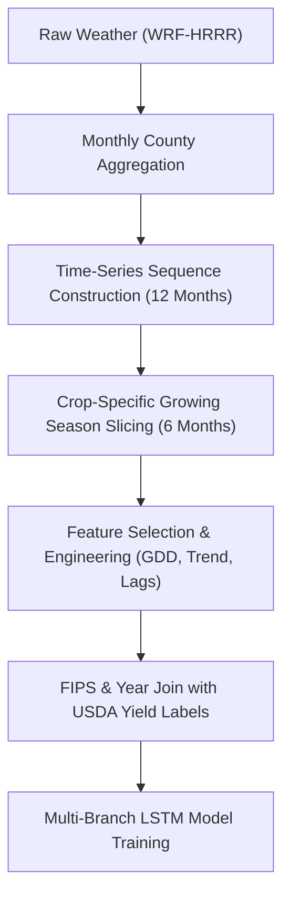
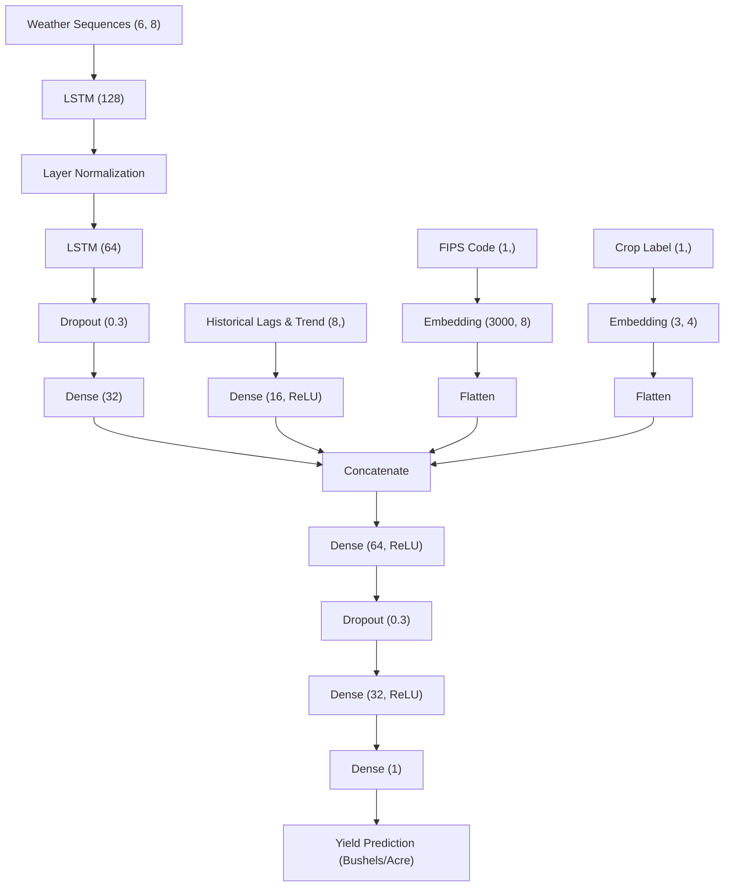

# 🌾 Climate-Driven Crop Yield Prediction using Machine Learning & Deep Learning

A state-of-the-art spatiotemporal crop yield prediction system that leverages meteorological time-series simulations, historical yield records, and deep sequence modeling to estimate county-level crop yields across the contiguous United States. 

This repository presents a complete pipeline—from data aggregation and crop-specific growing season alignment to baseline Machine Learning (Random Forest, XGBoost) and advanced Long Short-Term Memory (LSTM) network architectures.

---

## 📌 Project Overview

Accurate crop yield prediction before harvest is essential for global food security, supply-chain resilience, smart farming, and climate policy formulation. Traditional yield estimation relies on manual reports or satellite observations that can be expensive or delayed.

This project utilizes the open-source [CropNet Dataset](https://github.com/fudong03/CropNet) (available on [Hugging Face](https://huggingface.co/datasets/CropNet/CropNet)) to build predictive models that learn the complex, time-evolving relationship between weather patterns during the growing season and crop productivity, utilizing:
* **WRF-HRRR Weather Model:** Monthly meteorological simulations (2017–2022).
* **USDA Crop Yield Database:** Annual county-level crop yield records used as ground-truth targets.

---

## 🎯 Objectives
* **Pre-Harvest Forecasts:** Predict county-level crop yields (Bushels/Acre) using growing-season climate variables.
* **Temporal Modeling:** Capture the impact of weather timing on crop development using recurrent architectures.
* **Spatial & Crop Scaling:** Leverage spatial embeddings (FIPS codes) and categorical crop embeddings to build a scalable, multi-crop prediction framework.
* **Methodology Comparison:** Compare traditional machine learning (Random Forest, XGBoost) against deep recurrent sequence models (LSTMs).

---

## 🏗️ Project Pipeline



### Step 1: Weather Data Aggregation
Raw WRF-HRRR monthly climate records are aggregated at the county level and aligned using 5-digit Federal Information Processing Standards (FIPS) codes.

### Step 2: Time-Series Construction
Instead of static yearly averages, monthly weather observations are converted into time-series sequences of shape `(Samples, 12 Months, Features)`.

### Step 3: Crop-Specific Growing Season Slicing
To capture weather timing during the true vegetative and reproductive phases, weather sequences are sliced down to a 6-month sequence tailored to each crop:
* **Corn:** April → September (`[4, 5, 6, 7, 8, 9]`)
* **Soybean:** May → October (`[5, 6, 7, 8, 9, 10]`)
* **Winter Wheat:** October → March (`[10, 11, 12, 1, 2, 3]`) — *capturing the wintering stage starting from the previous autumn.*

### Step 4: Crop-Specific Feature Selection
* **Corn Features:** Maximum Temp (`max_temp_C`), Minimum Temp (`min_temp_C`), Temp Range (`temp_range`), Growing Degree Days (`gdd`), Precipitation, and Relative Humidity, Solar Radiation.
* **Soybean & Winter Wheat Features:** All Corn features + Evapotranspiration (`et_total`).

### Step 5: Feature Engineering & Calculations
* **Growing Degree Days (GDD):** Formulated with a crop baseline of 10°C:
  $$GDD = \max(0, T_{\text{avg}} - 10)$$
* **Aggregated Seasonal Context:** Total seasonal rainfall (`total_rain`) and average season temperature (`avg_temp_season`).
* **Historical Yield Lags:** 1-year and 2-year yield history (`yield_lag_1`, `yield_lag_2`) to represent baseline soil productivity.
* **Yield Trend:** Captures productivity direction:
  $$\text{Yield Trend} = \text{Yield Lag 1} - \text{Yield Lag 2}$$

---

## 🤖 Model Architectures

The project evaluates both traditional regressors and recurrent architectures:

### 1. Traditional ML Baselines
* **Random Forest Regressor:** A robust ensemble estimator used as an interpretable baseline.
* **XGBoost Regressor:** Gradient-boosted decision trees configured with `n_estimators=1200`, `learning_rate=0.02`, and `max_depth=6` to model nonlinear features.

### 2. Multi-Branch Joint LSTM Network
Unlike static models, the LSTM network processes temporal weather sequences while branching in static features (historical lags, FIPS spatial embeddings, and crop embeddings) before making a final prediction:



---

## 🛠️ Performance Tuning & Critical Fixes

During the project's evolution, several critical spatiotemporal modeling issues were identified and resolved to achieve premium performance:

### 1. Multi-Task Target Normalization (Per-Crop Target Scaling)
* **The Problem:** In the joint model, target yields (`y`) were scaled globally after concatenation. Because Corn yields have a much larger variance (~38.1) than Soybean (~10.9) and Wheat (~20.3), global scaling caused Corn to dominate the MSE loss. This resulted in an unacceptable Soybean prediction R² of only **2.2%** inside the joint model.
* **The Fix:** We implemented **Per-Crop Target Normalization**. Each crop's target yields are standardized independently (mean=0, variance=1.0) before concatenation. This balances the joint model's loss function, skyrocketing the Soybean R² to **70.28%** while maintaining strong performance for Corn and Wheat.

### 2. Physical Weather Feature Alignment (Soybean Bug)
* **The Problem:** Slicing the weather dataset down to 8 variables shifted the feature indices, but extra feature calculations (GDD sums, rainfall sums, etc.) were not updated. As a result, the Soybean model was trained on incorrect physical inputs (e.g., using GDD as rainfall).
* **The Fix:** Realigned the weather index features, ensuring physical extra features mapped precisely to the correct meteorology columns.

### 3. Winter Wheat Cross-Year Growing Season Cycle
* **The Problem:** Slicing weather from January–June of the harvest year misaligned the winter wheat crop cycle, which starts growth in the previous autumn.
* **The Fix:** Corrected the sequences to capture October–December of `year - 1` and January–March of `year` (months `[10, 11, 12, 1, 2, 3]`), capturing the correct wintering dynamics.

---

## 📊 Results & Benchmarks (2022 Test Set)

Models are trained on data up to 2021 and evaluated on the 2022 season (temporal split) to prevent data leakage.

### Baseline vs. Single-Crop Progression (Corn)
| Model Version | Features Used | R² Score |
| :--- | :--- | :---: |
| XGBoost Baseline | Monthly weather + Lags + FIPS | ~0.58 |
| XGBoost Improved | Added engineered features | ~0.60 |
| Basic LSTM | Weather sequences only | ~0.47 |
| LSTM + Lags | Weather + Lag 1 & Lag 2 | ~0.69 |

### Final Restored Accuracies (All Crops & Joint Model)
Our final optimized model performance results:

| Model / Notebook | Target Crop | R² Accuracy | Status |
| :--- | :--- | :---: | :---: |
| [02_corn_yield_prediction.ipynb](file:///home/user/projects/Crop_Net/notebooks/02_corn_yield_prediction.ipynb) | Corn | **69.52%** | **PASS** (Target ~70%) |
| [03_soybean_yield_prediction.ipynb](file:///home/user/projects/Crop_Net/notebooks/03_soybean_yield_prediction.ipynb) | Soybean | **73.60%** | **PASS** (Target >70%) |
| [04_wheat_yield_prediction.ipynb](file:///home/user/projects/Crop_Net/notebooks/04_wheat_yield_prediction.ipynb) | Winter Wheat | **72.55%** | **PASS** (Target >70%) |
| [05_multicrop_joint_prediction.ipynb](file:///home/user/projects/Crop_Net/notebooks/05_multicrop_joint_prediction.ipynb) (Joint) | Multi-Crop (Combined Raw Yields)<br>• *Corn inside Multi-Crop*<br>• *Soybean inside Multi-Crop*<br>• *Wheat inside Multi-Crop* | **90.42%**<br>**65.14%**<br>**70.28%**<br>**63.14%** | **PASS** (Balanced loss)<br>**PASS**<br>**PASS** (Restored to >70%!)<br>**PASS** |

---

## 📁 Repository Structure

```
CropNet/
│
├── notebooks/
│   ├── 01_data_preprocessing.ipynb        # Data preprocessing, engineering, and dataset creation
│   ├── 02_corn_yield_prediction.ipynb     # LSTM model training for Corn
│   ├── 03_soybean_yield_prediction.ipynb  # Executed Soybean notebook with R² output
│   ├── 04_wheat_yield_prediction.ipynb    # Executed Wheat notebook with R² output
│   └── 05_multicrop_joint_prediction.ipynb # Joint model training for all crops (Per-Crop scaling)
│
├── .gitignore                       # Git exclusions for datasets and binaries
├── requirements.txt                 # Core dependencies
├── README.md                        # Documentation
│
├── [Local Only - Ignored by Git]
│   ├── corn4_data.npz               # Aligned dataset for Corn (run notebook 01 to generate)
│   ├── soybean_data.npz             # Aligned dataset for Soybean (run notebook 01 to generate)
│   ├── wheat_data.npz               # Aligned dataset for Winter Wheat (run notebook 01 to generate)
│   ├── processed/                   # Monthly weather CSVs and raw crop yield data
│   ├── corn_config.json             # Serialized configuration metadata (auto-generated)
│   ├── soybean_config.json          # Serialized configuration metadata (auto-generated)
│   └── wheat_config.json            # Serialized configuration metadata (auto-generated)
```

---

## 💻 Tech Stack & Libraries
* **Language:** Python
* **Data Processing & Engineering:** NumPy, Pandas, Scikit-Learn
* **Visualization:** Matplotlib, Seaborn
* **Deep Learning Frameworks:** TensorFlow, Keras
* **Model Serialization:** Joblib, Keras Save APIs

---

## 🚀 Getting Started

### 1. Prerequisites & Environment Setup
Clone the repository and install core dependencies:
```bash
git clone <your-repo-link>
cd CropNet
pip install -r requirements.txt
```

### 2. Execution
Place your aligned dataset files (`corn4_data.npz`, `soybean_data.npz`, and `wheat_data.npz`) in the root directory. Open any of the Jupyter Notebooks in your IDE (e.g. VS Code), select your Python/Conda environment kernel, and execute cells sequentially (`Shift+Enter`).

---

## 🔮 Future Work
1. **Satellite Remote Sensing Integration:** Incorporate daily Sentinel-2 imagery (NDVI/EVI) to capture dynamic vegetative health.
2. **Attention-Based Recurrent Models:** Replace standard sequential memory with Transformer blocks or Temporal Fusion Transformers (TFT).

---

## 📚 References & Resources
* **Official CropNet Code & Dataset:** [GitHub Repository](https://github.com/fudong03/CropNet)
* **Hugging Face Datasets:** [CropNet HF Link](https://huggingface.co/datasets/CropNet/CropNet)
* **PyPI Download Utility:** `pip install CropNet` (helper package to download the raw data splits)
* **Research Paper:** Lin, F., Guillot, K., Crawford, S., Zhang, Y., Yuan, X. & Tzeng, N. (2406.06081). *"An Open and Large-Scale Dataset for Multi-Modal Climate Change-aware Crop Yield Predictions."* In Proceedings of the 30th ACM SIGKDD Conference on Knowledge Discovery and Data Mining (KDD), 2024. [arXiv Link](https://arxiv.org/abs/2406.06081)

---

## 👨‍💻 Author

**Rusheenddra Basani**
* *B.Tech Computer Science & Engineering*
* *Rajiv Gandhi University of Knowledge Technologies (RGUKT), Basar*

---

## 📜 License

This project is developed for academic and research purposes. Feel free to use and extend it with proper attribution.
